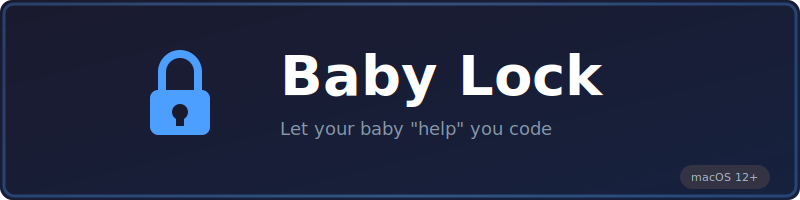

<p align="center">
  
</p>

<p align="center">
  <strong>A macOS menu bar app that locks your keyboard and mouse so babies can safely watch the screen</strong>
</p>

<p align="center">
  <a href="#features">Features</a> •
  <a href="#installation">Installation</a> •
  <a href="#usage">Usage</a> •
  <a href="#requirements">Requirements</a> •
  <a href="#building-from-source">Building</a> •
  <a href="#contributing">Contributing</a> •
  <a href="#license">License</a>
</p>

<p align="center">
  
  
  
</p>

---

## The Problem

You want to let your baby watch a video or educational app, but tiny hands love to mash keyboards and click everything in sight. Before you know it, they've:

- Closed the video
- Opened 47 browser tabs
- Deleted your important email
- Somehow changed your system language to Klingon

## The Solution

**Baby Lock** is a simple menu bar app that blocks all keyboard and mouse input with a single hotkey. A soft blue glow around the screen lets you know it's active, and the same hotkey unlocks everything when you're done.

## Features

- **One Hotkey to Rule Them All** — Press `Cmd+Shift+B` to lock, press again to unlock
- **Visual Feedback** — Soft blue glow border indicates when lock is active
- **Menu Bar App** — Lives quietly in your menu bar, no dock icon clutter
- **Works Everywhere** — Blocks input even in fullscreen videos and apps
- **Launch at Login** — Optionally start with your Mac
- **Lightweight** — Native Swift app with minimal resource usage

## Installation

### Download

Download the latest release from the [Releases](https://github.com/PepijnSenders/baby-lock/releases) page.

1. Download `BabyLock.zip`
2. Unzip and drag `BabyLock.app` to your Applications folder
3. Launch Baby Lock
4. Grant Accessibility permission when prompted (required for input blocking)

### Homebrew (Coming Soon)

```bash
brew install --cask baby-lock
```

## Usage

### Quick Start

1. **Launch** Baby Lock — Look for the lock icon in your menu bar
2. **Grant Permission** — Allow Accessibility access in System Settings
3. **Lock** — Press `Cmd+Shift+B` to lock all input
4. **Unlock** — Press `Cmd+Shift+B` again to unlock

### Menu Bar

Click the menu bar icon to access:

| Option | Description |
|--------|-------------|
| Permission Status | Shows if Accessibility permission is granted |
| Toggle Lock | Lock/unlock input (same as hotkey) |
| Launch at Login | Start Baby Lock when you log in |
| Quit | Exit the application |

### Icon States

| Icon | State |
|------|-------|
| 🔓 | Unlocked — Normal operation |
| 🔒 | Locked — All input blocked |
| ⚠️ | Permission needed — Click to grant access |

## Requirements

- **macOS 12.0** (Monterey) or later
- **Accessibility Permission** — Required for input interception

### Why Accessibility Permission?

Baby Lock needs to intercept keyboard and mouse events system-wide. macOS requires explicit user permission for this capability to protect your privacy. The app only blocks input when you activate the lock — it never records, logs, or transmits any input data.

## Building from Source

### Prerequisites

- Xcode 14.0 or later
- macOS 12.0 or later

### Build

```bash
# Clone the repository
git clone https://github.com/PepijnSenders/baby-lock.git
cd baby-lock

# Build with Xcode
xcodebuild -scheme BabyLock -configuration Release build

# Or open in Xcode
open BabyLock.xcodeproj
```

### Run

```bash
# Run the built app
open build/Release/BabyLock.app
```

## Architecture

Baby Lock is built with modern Swift and follows clean architecture principles:

```
BabyLock/
├── BabyLockApp.swift          # App entry point and lifecycle
├── LockManager.swift          # Lock state machine
├── InputInterceptor.swift     # CGEventTap for input blocking
├── OverlayWindow.swift        # Visual blue glow overlay
├── MenuBarManager.swift       # Menu bar UI
├── HotKeyManager.swift        # Global hotkey handling
├── SystemEventManager.swift   # Sleep/wake event handling
├── AccessibilityPermission.swift  # Permission management
└── LaunchAtLoginManager.swift # Launch at login feature
```

### Key Technologies

- **SwiftUI** — Modern declarative UI
- **AppKit** — System integration and menu bar
- **CGEventTap** — Low-level input interception
- **SMAppService** — Launch at login (macOS 13+)

## How It Works

1. **Hotkey Detection** — Monitors for `Cmd+Shift+B` using `NSEvent` global monitors
2. **Input Blocking** — Creates a `CGEventTap` at the session level to intercept all keyboard and mouse events
3. **Visual Overlay** — Displays a full-screen transparent window with an animated blue glow border
4. **Safety** — The unlock hotkey always works, even when locked

## FAQ

### Can I change the hotkey?

Not currently, but this is planned for a future release. For now, `Cmd+Shift+B` is the only option.

### Does it work with multiple monitors?

Currently, the visual overlay only appears on the main display. Input is blocked on all displays. Multi-monitor overlay support is planned.

### Can I still use Force Quit?

Yes! `Cmd+Option+Esc` (Force Quit) always works, as a safety measure built into macOS.

### Will it drain my battery?

No. Baby Lock uses minimal resources when idle and the overlay is GPU-accelerated for efficiency.

### Is my input being recorded?

No. Baby Lock only blocks input events — it never stores, logs, or transmits any keyboard or mouse data.

## Contributing

Contributions are welcome! Please feel free to submit a Pull Request.

1. Fork the repository
2. Create your feature branch (`git checkout -b feature/amazing-feature`)
3. Commit your changes (`git commit -m 'Add amazing feature'`)
4. Push to the branch (`git push origin feature/amazing-feature`)
5. Open a Pull Request

### Development Guidelines

- Follow Swift API Design Guidelines
- Add tests for new functionality
- Update documentation as needed
- Keep commits focused and atomic

## Roadmap

- [ ] Customizable hotkey
- [ ] Multi-monitor overlay support
- [ ] Customizable glow color
- [ ] Timer mode (auto-unlock after X minutes)
- [ ] Whitelist specific apps

## License

This project is licensed under the MIT License — see the [LICENSE](LICENSE) file for details.

## Acknowledgments

- Built with love for parents everywhere
- Inspired by every parent who's had a toddler "help" with their computer

---

<p align="center">
  Made with ❤️ for parents and their curious little ones
</p>
